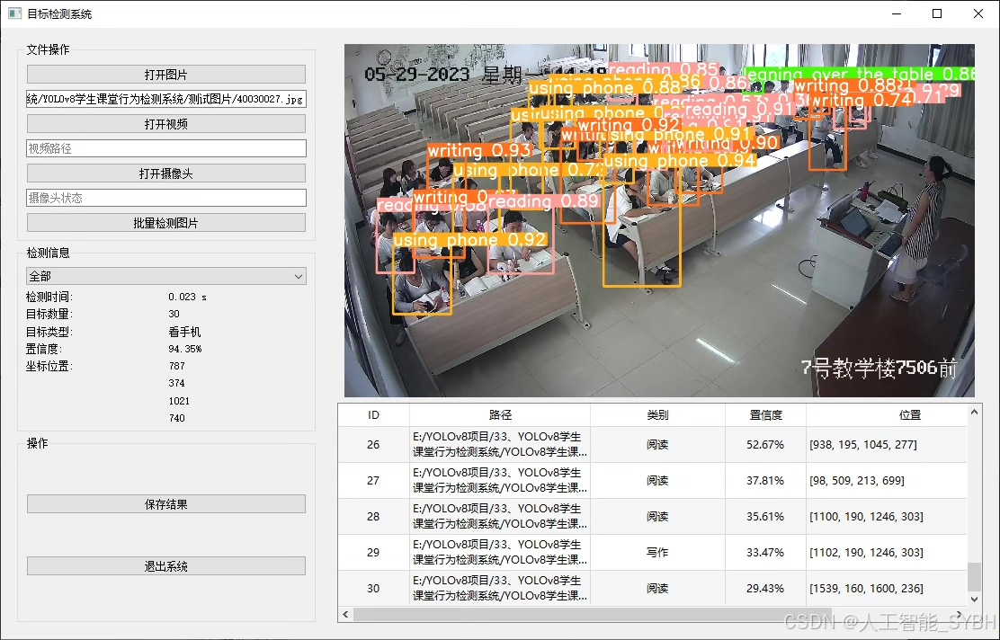
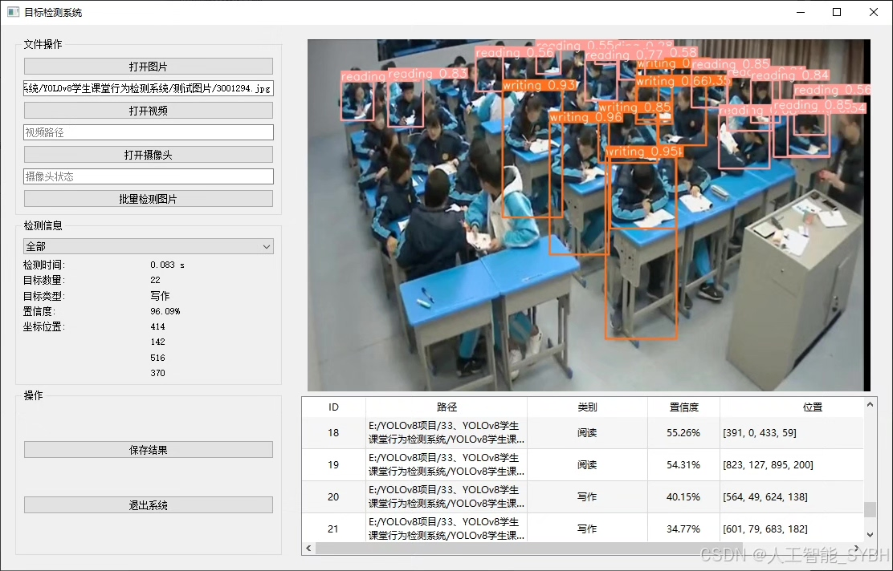
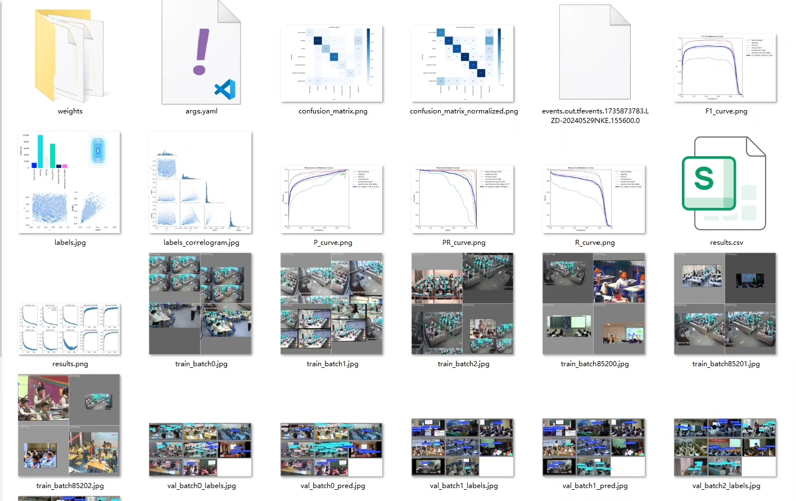
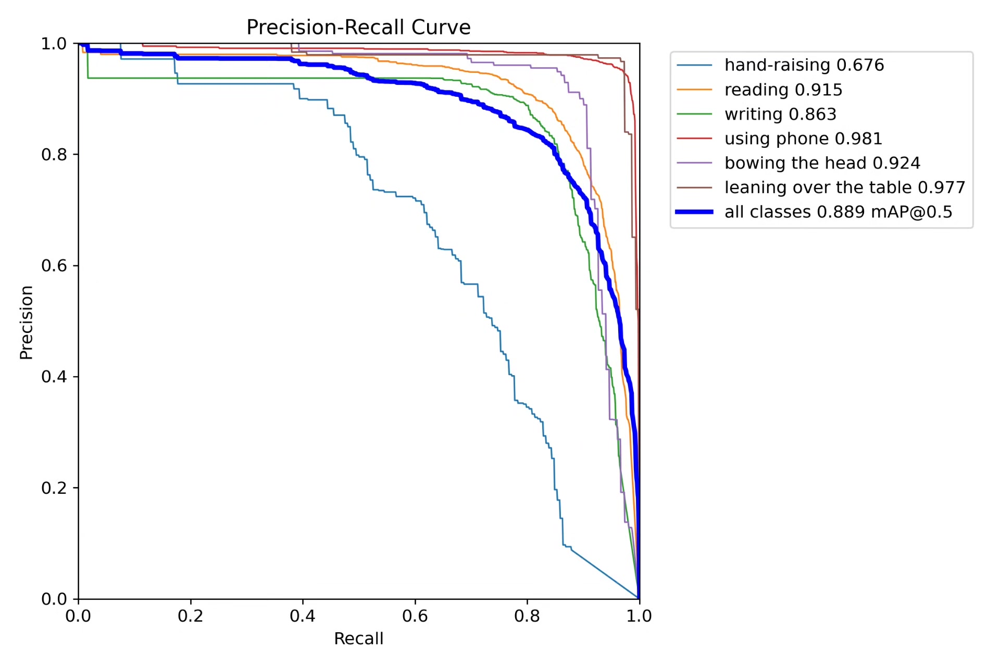
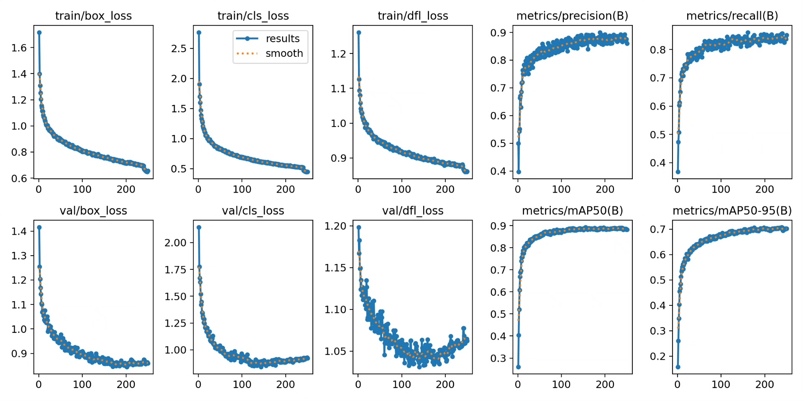
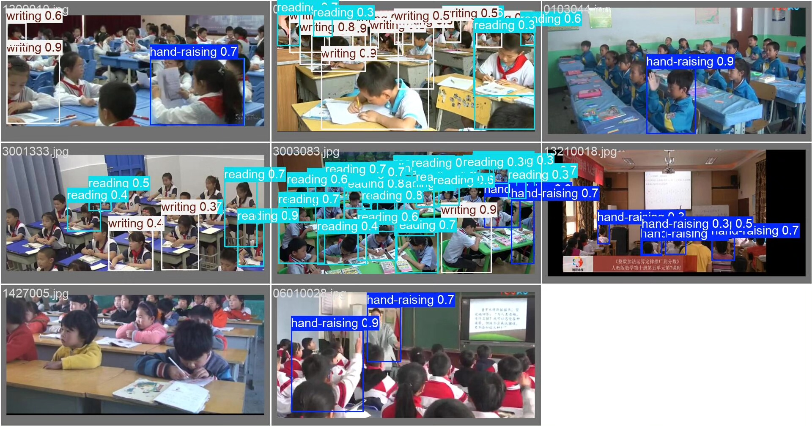
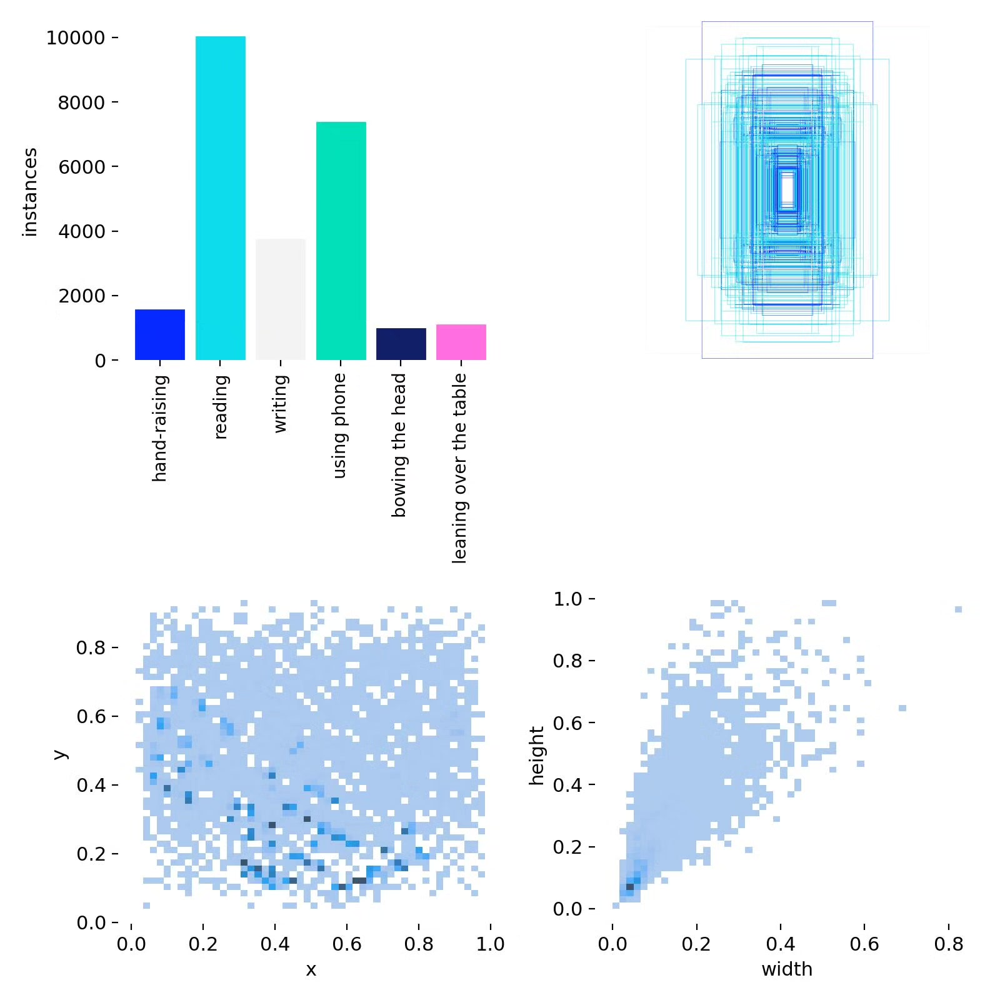
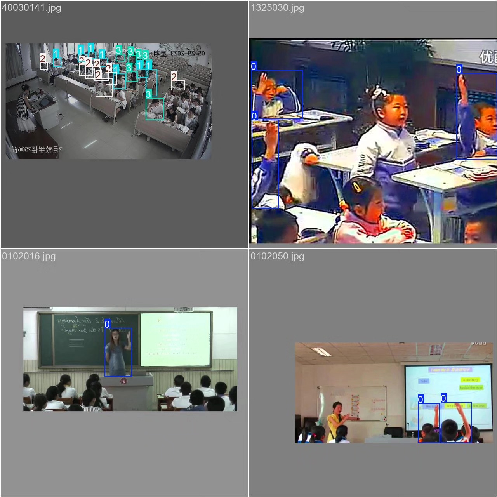

# Student Classroom Behavior Detection System Based on YOLOv8 Deep Learning (YOLOv8)

## Body

Based on the YOLOv8 deep learning algorithm, a student classroom behavior detection system has been developed. This project is specifically designed to recognize and analyze six typical behaviors of students in the classroom. The system can detect and classify the following behaviors in real-time: raising hands (hand-raising), reading (reading), writing (writing), using a phone (using phone), bowing the head (bowing the head), and leaning over the table (leaning over the table). The project uses a dataset containing 2032 labeled images, with 1422 training images, 203 validation images, and 407 test images, ensuring the reliability of model training and evaluation.

The company's products have obtained the official commercial license certification from YOLO.

We provide after-sales service.

After payment, we will provide WeChat ID for any questions you may have.

Environment configuration: We will provide an instructional tutorial on how to set up the environment, and WeChat will provide answers to questions.

Remote installation service: If you need remote configuration, an additional fee of 69 is required, and if the configuration fails, all fees will be refunded (only the installation fee is refunded for special old computers).

Retraining the dataset: After setting up the environment, you can train on your own computer. If you need us to retrain, just pay 69 plus the computing power fee (2.5 yuan/hour).

Full after-sales service

## Images

## Payment

Here is a pay link on Stripe ( https://buy.stripe.com/3cs8yP7sY87d0vu9AB ). Please contact me lonlonago@foxmail.com after funding $89, and I will send you a complete data files , thank you!

